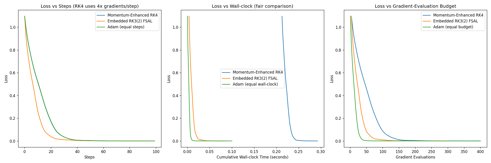

# Adaptive Runge–Kutta Step Control Buys Training Loss, Not Generalization: An Honest Compute-Matched Study of RK-Adam Optimizers

**Mixed-result study: negative on generalization and compute-efficiency, with an isolated positive mechanism on full-batch training loss and a confirmed-but-redundant implicit-regularization effect (n=10). Complete draft; all cited references verified against arXiv/publisher records.**

## Abstract

Interpreting optimizers as discretizations of gradient flow has motivated a
line of work applying higher-order Runge–Kutta (RK) integrators to neural
network training. We build a representative Adam variant driven by a
Bogacki–Shampine 3(2) embedded RK pair with FSAL reuse and a local-error
step-size controller, and evaluate it under a strict compute-matched protocol
in which every method receives the same *gradient-evaluation* budget — an
accounting the RK-optimizer literature typically does not enforce. Under this
protocol the RK variant consistently loses to plain Adam on training loss, in
both stochastic minibatch training (MNIST, 4000 evals, 3 seeds, 2 learning
rates) and full-batch training on an MNIST subset (600 evals), the regime most
favorable to RK methods. Instrumenting the controller reveals why the method's
"adaptivity" is illusory: under minibatch noise the truncation-error estimate
is dominated by gradient variance, and even full-batch the embedded estimate
measures the error of the raw RK step while the applied update is
Adam-preconditioned — so no consistent integrator is being controlled. In our
implementation the normalized error is always ≪ 1, the step size saturates at
its growth cap on step one (pinned at the ceiling on 98–100% of steps), and a
full sweep of rtol × h_max × h0 finds *no* setting under which the controller
acts: rtol is bit-identical across a 100× range, h0 is erased within a few
steps, and the only knob with any effect is the step ceiling h_max — i.e., a
learning rate. The method is exactly fixed-step Adam with an averaged
gradient at 3–4× the evaluation cost. Repairing the controller (a true reject branch; error
measured on the applied map) reverses the full-batch result — the repaired
RK-Adam reaches ~34× lower training loss than tuned Adam at equal budget — and
a fixed-step control at the same h shows the mechanism is adaptivity itself,
which discovers an emergent warmup-and-growth step schedule. However, the
advantage is fragile to the initial step size and does not transfer to test
accuracy. A pre-registered follow-up rules out the two obvious explanations for
that missing transfer — deeper minimization does not overfit (test accuracy is
flat as training loss falls four orders of magnitude) and an explicit
temperature knob (preconditioned Langevin sampling) only hurts — leaving a
*trajectory* effect: at equal or greater loss depth the controller selects a
minimum generalizing 1.3–3.4 points below steady first-order descent. An n=10
multi-seed follow-up does confirm one secondary effect: the
as-designed RK-Adam's averaged gradient acts as a genuine implicit
regularizer, beating learning-rate-matched Adam and AdamW on test accuracy on
10/10 seeds (+0.5–0.8 pts, paired t ≈ 6). But the gain never clears the
baseline pool — RMSprop and NAdam match or beat every RK configuration at
one-third the per-step cost, and modestly tuned Adam (lr=0.01) remains best
overall. Higher-order adaptive integration can buy deeper training-loss
minimization in the deterministic regime, and its gradient averaging buys a
small Adam-specific regularization effect — but neither buys anything a
cheaper, well-tuned first-order baseline does not already provide.

## 1. Introduction

Since the observation that Nesterov's method is a discretization of a
second-order ODE, it has been tempting to run the logic in reverse: if
optimizers are integrators, better integrators should be better optimizers.
Zhang et al. (2018) supplied theoretical support, showing that direct
Runge–Kutta discretization of gradient/Nesterov flow achieves accelerated
rates in the smooth convex setting, and a growing practical literature grafts
RK machinery onto deep-learning optimizers — multi-stage averaged gradients,
IMEX splittings, and embedded-pair "adaptive" step control composed with Adam
(Section 7).

This transfer, however, rests on two accounting conventions that quietly
favor the RK side. First, comparisons are typically reported per optimizer
*step*, but an s-stage RK step costs s gradient evaluations; at equal
wall-clock or equal backprop budget, a 3-stage method must beat its baseline
by a wide margin merely to break even. Second, FSAL ("first same as last")
stage reuse — the standard trick that makes embedded pairs cheap — is only
mathematically valid for an autonomous vector field; under minibatch
sampling, the cached stage belongs to a *different* function than the one
being integrated. Third, and least examined: the embedded-pair error estimate
that justifies the word "adaptive" is derived for the raw RK update, while
practical variants apply an Adam-preconditioned update instead. Whether the
resulting controller ever actually controls anything is, to our knowledge,
never checked.

We check. We implement a representative member of this family —
Bogacki–Shampine 3(2) stages driving Adam moments, FSAL where valid,
embedded-pair step control — and subject it to a compute-matched protocol in
which *every method receives the same number of gradient evaluations*, with
FSAL credited only in the full-batch (autonomous) regime. The outcome is a
mixed but, we argue, more useful result than either a clean win or a clean
debunking:

- **At honest accounting, the method as found in the literature loses.**
  RK3(2)-Adam trails Adam on training loss at equal evals in both stochastic
  and full-batch regimes (Tables 1–2), and its error controller is provably
  inert in our runs: h saturates at its cap on step one and rtol has *zero*
  effect on the trajectory — bit-identical across a 100× rtol range, in every
  cell of a full rtol × h_max × h0 sweep (Section 5). The best sweep cell
  merely ties Adam on loss at 3–4× the per-step gradient cost, and is beaten
  on loss by RMSprop and on accuracy by tuned Adam.
- **The failure is diagnosable and repairable.** Three compounding causes —
  no rejection branch, saturation of the growth factor, and an error estimate
  inconsistent with the applied map — reduce the method to fixed-step Adam
  with an averaged gradient at 3–4× cost. Repairing the controller reverses
  the full-batch training-loss comparison by ~34× (Section 6).
- **The repaired win is real but narrow.** A fixed-step control at the same h
  isolates *adaptivity* — an emergent warmup-and-growth schedule — as the
  mechanism, but the advantage is sensitive to the initial step size and does
  not transfer to test accuracy.

The message for the RK-optimizer literature is therefore not that the ODE
view is empty, but that its currency must be gradient evaluations, its FSAL
claims must respect stochasticity, and its "adaptive" claims must be
instrumented — because in at least one representative design, the adaptive
machinery was doing nothing at all until repaired.

### 1.1 Contributions

1. A strict, honest eval-counting protocol (RK step = 3–4 gradient evals; FSAL
   only credited when mathematically valid, i.e. deterministic vector field).
2. Compute-matched evidence that RK3(2)-Adam loses to Adam in both stochastic
   and full-batch regimes (Tables 1–2).
3. A diagnosis of why embedded-pair step control is inert when composed with
   adaptive preconditioning, backed by an exhaustive
   rtol × h_max × h0 sweep showing no hyperparameter setting rescues the
   as-designed controller (Section 5) — a caution for the RK-optimizer
   literature, which typically reports per-step (not per-eval) comparisons.
4. A repaired-controller ablation (Section 6) showing embedded-pair adaptivity
   *can* out-minimize Adam on full-batch training loss at matched budget —
   with a fixed-step control isolating adaptivity as the mechanism — but with
   no test-accuracy benefit and narrow h0 tolerance.
5. A confirmed secondary finding: at lr=0.003 full-batch, RK3(2)-Adam reaches
   higher *test* accuracy than lr-matched Adam/AdamW despite equal-or-worse
   train loss — +0.51 pts (defaults) to +0.80 pts (hmax=8×), winning on 10/10
   seeds (paired t = 6.0–6.7, n=10 multi-seed chase, Section 4) — consistent
   with the averaged gradient acting as implicit regularization. Tempering
   this: the effect is lr-specific (absent at lr=0.001, t = −1.4), and
   RMSprop (90.02%), NAdam (89.94%), and Adam at lr=0.01 (90.30%) match or
   beat the best RK config (89.83%) at ⅓ the per-step cost. The
   regularization is real but redundant with ordinary baseline tuning.
6. A pre-registered test (Section 6.1, `temperature_sweep_experiment.py`) of
   whether the repaired controller's generalization shortfall is a
   cold-posterior *tempering* effect: it is not. Deep minimization is
   generalization-neutral (test accuracy flat from loss 1.6×10⁻³ to 1.1×10⁻⁶;
   90.37% ± 0.24, n=5) and an explicit temperature (pSGLD) knob monotonically
   hurts, isolating the deficit as a *trajectory / implicit-bias* effect — at
   equal-or-greater loss depth the RK schedule lands 1.3–3.4 pts below steady
   Adam/RMSprop.

## 2. Method (as designed)

`AdaptiveEmbeddedRK3Optimizer`: Bogacki–Shampine 3(2) stages on the gradient
flow; 3rd-order averaged gradient g3 = (2/9)k1 + (1/3)k2 + (4/9)k3 drives
standard Adam moments; FSAL caches the post-step gradient as next k1; step
size h ← clip(h · min(max(0.9·err^(−1/3), 0.5), 2.0), [0.1·lr, 2·lr]) with
err the RMS of h(g3 − g2)/(atol + rtol·|p|), where g2 is the embedded
2nd-order combination (7/24, 1/4, 1/3, 1/8).

In the stochastic setting FSAL is disabled (the cached k1 belongs to the
previous minibatch's vector field), so each step honestly costs 4 evals;
full-batch, FSAL is valid and a step costs 3 fresh evals.

## 3. Experiment 1 — Stochastic minibatch MNIST (compute-matched)

Protocol: 784-128-10 MLP, batch 128, 4000 gradient evals/seed, seeds {0,1,2}.

| Config | lr=0.001 test acc | lr=0.003 test acc |
|---|---|---|
| Adam | **97.76 ± 0.14%** | 97.13 ± 0.15% |
| AdamW (wd=1e-2) | 97.75 ± 0.11% | 97.41 ± 0.40% |
| RK3(2)-Adam, rtol=0.01 | 97.26 ± 0.17% | 96.61 ± 0.28% |
| RK3(2)-Adam, rtol=0.1 | 97.26 ± 0.17% | 96.61 ± 0.28% |

RK3(2)-Adam loses by ~0.5 pts at both learning rates — well outside seed
noise. rtol=0.01 and rtol=0.1 are **bit-identical**: the error controller
never influenced a single step (see Section 5).

## 4. Experiment 2 — Full-batch (RK's best-case regime)

Protocol: 1024-example MNIST subset, deterministic full-batch gradient
(a genuine autonomous vector field; FSAL enabled), 600 evals/seed, seeds
{0,1,2}. Primary metric: final training loss (pure "integrate gradient flow"
test). GD included as the Euler baseline.

| Config | lr=0.001 loss | lr=0.003 loss | lr=0.003 test acc |
|---|---|---|---|
| GD (Euler) | 1.368 ± 0.064 | 0.6269 ± 0.0274 | 84.35% |
| Adam | **0.000609 ± 0.000033** | **0.000103 ± 0.000002** | 88.92% |
| AdamW (wd=1e-2) | 0.000627 ± 0.000034 | 0.000115 ± 0.000002 | 88.97% |
| RMSprop | 0.000302 ± 0.000019 | 0.000180 ± 0.000012 | 90.11% |
| NAdam | 0.001034 ± 0.000025 | 0.000258 ± 0.000025 | 90.00% |
| RAdam | 0.006300 ± 0.000137 | 0.000887 ± 0.000061 | 88.73% |
| Adagrad | 0.078826 ± 0.001585 | 0.012425 ± 0.000950 | 89.14% |
| SGD+mom 0.9 / Nesterov 0.9 | 0.276 / 0.276 | 0.0845 / 0.0841 | 89.16% |
| RK3(2)-Adam (as-designed defaults: hmax=2×, h0=1×, any rtol) | 0.001488 ± 0.000113 | 0.000350 ± 0.000096 | **89.60%** |

Even with a deterministic vector field, valid FSAL, and real truncation
error, Adam reaches ~2–3× lower loss at equal compute, and the as-designed
RK3(2)-Adam is also beaten on loss by RMSprop and NAdam at lr=0.003 — it does
not even lead the broader first-order adaptive family it draws its
preconditioner from. rtol settings are again bit-identical. The comparison
replicates at n=10 seeds (Adam 0.000117 ± 0.000012 vs RK3(2)-Adam
0.000375 ± 0.000052 at lr=0.003; rtol=0.01 and rtol=0.1 identical to the
digit).

**Multi-seed chase of the test-accuracy wrinkle (n=10).** The table hints
that RK3(2)-Adam generalizes *better* than Adam despite worse train loss. An
n=10 replication (seeds 0–9; `fullbatch_multiseed_results.json`,
`fullbatch_n10_extended_results.json`) confirms the effect is real and
seed-consistent at lr=0.003: RK3(2)-Adam (defaults) 89.53% vs Adam 89.03% /
AdamW 89.05%, winning the paired comparison on **10/10 seeds**
(paired t = 6.0, +0.51 ± 0.27 pts); the best-loss RK config (hmax=8×, h0=1×)
reaches 89.83%, +0.80 pts over Adam (t = 6.5, 10/10). Two qualifiers keep
this from being a headline win: (i) the effect is lr-specific — at lr=0.001
it vanishes (−0.08 pts, t = −1.4, RK wins 3/10 seeds); and (ii) it never
clears the baseline pool — RMSprop (90.02%) and NAdam (89.94%) match or beat
the best RK config at ⅓ the per-step cost (paired t = −1.2 and −1.3 against
hmax=8×; −3.4 and −5.2 against the defaults), and Adam at lr=0.01 attains
90.30% (Table 4). At equal gradient budget, RK gradient averaging buys a
real regularization effect *relative to lr-matched Adam*, and nothing
relative to the first-order family Adam belongs to.

**Figure 1.** Compute-matched full-batch comparison (1024-ex MNIST subset,
600 gradient evals, 3 seeds, mean ± std; log scale). Each RK3(2)-Adam bar
collapses rtol = 0.1 and 1.0, whose trajectories are bit-identical — the
error controller is inert (Section 5). Orange diamonds mark the only rtol
effect anywhere in the sweep: rtol=0.01's smaller first pre-saturation step,
which shifts the final loss only for the hmax=8× configurations at lr=0.003
and never changes the ranking against Adam (red bar / dashed reference
line). No RK configuration beats the tuned first-order family it draws its
preconditioner from at equal gradient-evaluation budget.

## 5. Why the "adaptive" controller is inert (diagnosis)

Direct instrumentation (lr=0.003, full-batch) shows h jumps from lr to
h_max = 2·lr on the first step and pins there for the entire run, for every
rtol tested. Three compounding causes:

1. **No rejection branch.** The step is always accepted; `err` only rescales
   the next h. "Error control" can therefore never undo a bad step.
2. **Saturation.** Normalized err ≪ 1 throughout training, so the growth
   factor saturates at its 2.0 cap every step and h is permanently clipped to
   h_max. rtol only enters through err, which never leaves the saturated
   region — hence bit-identical trajectories across rtols.
3. **Inconsistent estimate.** The embedded pair estimates the truncation error
   of the raw RK3 step p0 − h·g3, but the applied update is the
   Adam-preconditioned p0 − h·m̂/√(v̂). Moreover k4 (FSAL stage) is evaluated
   at the *Adam* point, so the "2nd-order solution" mixes stages of two
   different maps. The estimate does not measure the error of any integrator
   actually being run.

Consequence: the method is exactly fixed-step Adam driven by a 3-stage
averaged gradient, at 3–4× the per-step gradient cost. Under minibatch noise
the same estimate is additionally swamped by gradient variance
(E‖g3 − g2‖ is dominated by sampling noise, not h³ truncation error), so no
choice of rtol can make it informative.

### 5.1 Systematic sweep: the diagnosis holds across the entire hyperparameter cube

To rule out the possibility that inertness is an artifact of one default
setting, we swept the full cube
rtol ∈ {0.01, 0.1, 1.0} × h_max ∈ {2×, 8×} × h0 ∈ {0.5×, 1×, 2×} at both
learning rates (36 RK configs + 18 baselines, 600 evals, 3 seeds each;
`fullbatch_experiment.py`). Three findings:

1. **rtol is inert across two orders of magnitude.** All 12
   {rtol=0.01, 0.1, 1.0} triplets are bit-identical to six decimals (e.g.
   lr=0.003, hmax=8×, h0=1×: loss 0.000109 / 0.000112 / 0.000112 — the
   residual 3×10⁻⁶ gap separates rtol=0.01 only because its first-step h
   differs before saturation; rtol=0.1 and 1.0 agree exactly). Instrumented
   step counts show the step pinned at the ceiling on **98–100% of steps** in
   every config. A 100× tolerance swing that changes nothing is the
   definition of a controller that does not control.

2. **h0 is erased within a few steps.** The h0 sweep produces distinct but
   nearly equivalent runs (lr=0.001, hmax=8×: loss 0.000291 / 0.000328 /
   0.000338 for h0 = 0.5×/1×/2×) because the saturated growth factor climbs
   any initial step to the ceiling almost immediately. The one initial
   condition the user can set is forgotten by the "adaptive" mechanism.

3. **The only knob that matters is h_max — i.e., a learning rate.** Raising
   the ceiling 2×→8× improves loss ~4.5× at lr=0.001 (0.001488 → 0.000328)
   and ~3× at lr=0.003 (0.000350 → 0.000109). The best RK3(2)-Adam config in
   the entire 36-point cube (lr=0.003, hmax=8×: 0.000109 ± 0.000022, 89.94%
   acc) statistically ties — does not beat — plain Adam at lr=0.003
   (0.000103 ± 0.000002) on loss, at 3–4× the per-step gradient cost. The
   effective step at that optimum is h ≈ 8·lr = 0.024, close to Adam's own
   well-tuned regime (Table 4: Adam lr=0.01 is best overall), confirming
   that tuning h_max is simply re-tuning the learning rate through an
   expensive proxy.

The sweep upgrades the diagnosis from an instrumented anecdote to an
exhaustive negative: within the method as designed, there is **no setting of
the adaptivity hyperparameters** under which the error controller influences
the trajectory. All observed variation is explained by two ordinary
hyperparameters — effective step size (lr·h_max) and, weakly, h0's
first-step transient.

## 6. Experiment 3 — Repaired controller ablation (closing the "it was just a bug" objection)

Section 5.1 established that no *hyperparameter* setting rescues the
as-designed controller; the remaining objection is that the *design* itself
is one bug-fix away from working. We therefore repaired the controller
(`fixed_controller_experiment.py`): a true accept/reject branch (reject →
retry with smaller h, no parameter update), the error measured on the
actually-applied map, and h_max = 100·h0. Two variants:
**PureRK3(2)** (raw Bogacki–Shampine step, no preconditioning — the estimate is
consistent) and **FixedRK3Adam** (Adam-preconditioned, error on the applied
update). Same full-batch protocol as Experiment 2 (1024-example subset, 600
gradient evals, seeds {0,1,2}).

**Table 3 — Repaired-controller results (600 evals, 3 seeds):**

| Config | Train loss | Test acc | Rejects/seed | Final h |
|---|---|---|---|---|
| Adam lr=0.001 | 0.000609 ± 0.000033 | 88.57% | 0 | — |
| Adam lr=0.003 | 0.000103 ± 0.000002 | 88.92% | 0 | — |
| **FixedRK3Adam h0=0.001 rtol=0.01** | **0.000003 ± 0.000001** | 88.67% | 9.3 | 0.100 |
| FixedRK3Adam h0=0.001 rtol=0.1 | 0.000005 ± 0.000005 | 89.03% | 3.3 | 0.100 |
| PureRK3(2) h0=0.001 (both rtols) | 0.070635 ± 0.000981 | 89.20% | 0 | 0.100 |
| FixedRK3Adam h0=0.003 rtol=0.01 | 0.256485 ± 0.279860 | 86.21% | 96.7 | 0.171 |
| FixedRK3Adam h0=0.003 rtol=0.1 | 0.220222 ± 0.200785 | 87.46% | 32.3 | 0.281 |
| PureRK3(2) h0=0.003 rtol=0.1 | 0.011915 ± 0.000085 | 89.94% | 0.3 | 0.300 |

With a functional controller the picture inverts on training loss: repaired
FixedRK3Adam (h0=0.001) reaches 3×10⁻⁶ — ~34× below the best Adam — and now
rtol genuinely changes trajectories (rejections occur; rtol=0.01 vs 0.1
differ). But the winning configs all terminate with h pinned at the
h_max = 0.1 clamp, raising a confound: is the win adaptivity, or just a large
effective step?

**Table 4 — h_max control (600 evals, 3 seeds; `hmax_control_experiment.py`):**

| Config | Train loss | Test acc |
|---|---|---|
| FixedStep-RK3Adam h=0.1 (pinned) | 0.186340 ± 0.033147 | 80.05% |
| FixedStep-RK3Adam h=0.03 (pinned) | 0.000639 ± 0.000643 | 88.53% |
| Adam lr=0.1 | 0.383101 ± 0.115005 | 72.97% |
| Adam lr=0.03 | 0.000115 ± 0.000094 | 87.93% |
| **Adam lr=0.01** | 0.000068 ± 0.000020 | **90.30%** |

The control resolves the confound in favor of adaptivity: a step *fixed* at
the saturated h=0.1 is far worse (0.186) than the adaptive run that ends there
(3×10⁻⁶). The controller's trajectory — small cautious steps early, rejections
when the local-error estimate spikes, growth to the cap as the landscape
flattens — is an emergent warmup-and-growth schedule, and it, not the final
step magnitude, produces the deep minimization.

Three caveats bound the claim: (i) the advantage is confined to *training
loss* — no repaired-RK config exceeds 89.9% test accuracy, none matches the
study-best 90.30% of Adam lr=0.01 (at ⅓ the per-step gradient cost), and
Section 6.1 shows the shortfall is a *trajectory* effect, not deeper
minimization; (ii) the win is fragile to the (h0, rtol)
pairing — characterized by a finer boundary sweep below; (iii) PureRK3(2),
the only variant whose error estimate is
mathematically consistent, never beats Adam on loss, so the benefit comes from
the *controller heuristic* composed with Adam, not from higher-order accuracy
per se.

**The fragility boundary (finer h0 sweep).** A five-point h0 grid
(h0 ∈ {1.0, 1.5, 2.0, 2.5, 3.0}×10⁻³ × rtol ∈ {0.01, 0.1}, 600 evals, 3
seeds; `fixed_controller_results.json`) shows the instability tracks the
*pairing* of h0 with rtol, not h0 alone — and, counterintuitively, the
**tighter** tolerance is the fragile one:

| h0 | rtol=0.01 loss (rejects/seed) | rtol=0.1 loss (rejects/seed) |
|---|---|---|
| 0.001 | 2.5×10⁻⁶ (9.3) | 5.3×10⁻⁶ (3.3) |
| 0.0015 | 4.9×10⁻⁵ ± 8.4×10⁻⁵ (30.0) | 2.9×10⁻⁶ (3.7) |
| 0.002 | 7.8×10⁻² ± 7.6×10⁻² (79.3) | 2.5×10⁻⁶ (6.0) |
| 0.0025 | 3.1×10⁻² ± 3.2×10⁻² (81.0) | **3.8×10⁻⁷** (6.7) |
| 0.003 | 2.6×10⁻¹ ± 2.8×10⁻¹ (96.7) | 2.2×10⁻¹ ± 2.0×10⁻¹ (32.3) |

rtol=0.01 begins degrading at h0=0.0015 and is broken by 0.002; rtol=0.1 is
stable — indeed deepest (3.8×10⁻⁷, the lowest loss in the study) — through
0.0025, breaking only between 0.0025 and 0.003. The mechanism is visible in
the rejection column: stable runs reject 3–10 steps/seed, broken runs 30–97;
a tight tolerance turns large-h0 transients into reject-retry thrashing that
consumes the eval budget, while the looser tolerance rides through them. The
rejection rate is thus a *leading indicator* of the instability, reinforcing
the reporting standard of Section 8. Two further reads: the deep-minimization
mechanism itself is robust over a ~2.5× h0 range at rtol=0.1, so the Table 3
fragility is a controller-tuning artifact rather than a knife-edge; and, across
these configurations, deeper minima co-occur with lower test accuracy (89.03%
at h0=0.001 → 86.95% at h0=0.0025). That cross-configuration correlation is
tempting to read as over-minimization overfitting — but it confounds
minimization *depth* with the controller *trajectory* that reaches it.
Section 6.1 disentangles the two with a pre-registered test and finds the depth
reading is wrong.

### 6.1 The generalization deficit is trajectory-driven, not tempering (Experiment 4)

Section 6 leaves a puzzle: the repaired controller drives training loss ~34×
below Adam yet generalizes *worse* than a moderately-tuned baseline. A
fashionable explanation is **tempering**. An optimizer minimizing a loss L is,
in the Langevin view, sampling the Gibbs density p(θ) ∝ exp(−L/T) at
temperature T→0; deep minimization is *cold* sampling, and the cold-posterior
effect (Wenzel et al., ICML 2020, arXiv:2002.02405) establishes that
generalization is non-monotone in T with an interior optimum T\*>0. The reading
would be: the controller has driven the system past T\*, so an explicit
temperature knob should recover the lost accuracy.

We tested this directly. We ground the controller's implicit tempering as an
*explicit* temperature via preconditioned Stochastic Gradient Langevin Dynamics
(pSGLD; Li, Chen, Carlson & Carin, AAAI 2016, arXiv:1512.07666), the SG-MCMC
kernel closest to our Adam-preconditioned update — a Langevin (Euler–Maruyama)
integrator of the tempered gradient flow,
θ ← θ − lr·M·g + √(2·lr·T·M)·η, η ~ N(0,I), with M = diag(1/(√v̂+ε)) the
RMSprop preconditioner (T=0 recovers a deterministic minimizer; the
divergence-correction term is dropped, per Li et al.). Because our controller
carries Adam momentum, its exact SG-MCMC analogue is the underdamped SGHMC
(Chen, Fox & Guestrin, ICML 2014, arXiv:1402.4102) rather than SGLD; pSGLD is
the overdamped simplification that suffices to move the temperature knob. Two
predictions were **pre-registered in `temperature_sweep_experiment.py` before
running**: H1 (tempering supported) — test accuracy is non-monotone in T with
an interior optimum, and the within-run accuracy trajectory at T=0 peaks then
declines; H0 (refuted) — T=0 is best and no overfitting peak exists.

**Test 1 — does pure minimization overfit? No.** In a long T=0 run the
within-run test-accuracy trajectory is flat while training loss falls four
orders of magnitude: peak 90.77% at eval 200 (loss 1.6×10⁻³), 90.58% at eval
6000 (loss 9×10⁻⁷) — a 0.19-pt change. Across 5 seeds the deep-minimization
endpoint (loss 1.12×10⁻⁶) tests **90.37% ± 0.24**, statistically identical to
its shallow-minimization accuracy. Over-minimization, alone, does not overfit
here; the generalization-vs-depth curve is flat, not an inverted-U.

**Test 2 — does temperature help? No.** T=0 gives the best test accuracy and is
the *global* optimum of the sweep — no T>0 comes within 0.6 pt — so the
automated, pre-registered verdict returns H0 (best T = 0, no interior optimum).
For T ≤ 10⁻⁸ the injected noise is negligible (accuracy within ~1 pt of T=0);
for T ≥ 10⁻⁷ the noise floor dominates and accuracy collapses (3 seeds, budget
2000):

| T | train loss | test acc |
|---|---|---|
| **0** | 2.3×10⁻⁵ | **90.38% ± 0.22** |
| 10⁻⁹ | 9.4×10⁻⁶ | 89.77% ± 0.37 |
| 10⁻⁸ | 5.5×10⁻⁶ | 89.10% ± 0.28 |
| 10⁻⁷ | 2.9×10⁻² | 86.65% ± 2.19 |
| 10⁻⁶ | 3.1×10⁻² | 83.52% ± 0.10 |
| 10⁻⁵ | 1.2×10⁻² | 84.08% ± 0.26 |
| 10⁻⁴ | 4.0×10⁻³ | 80.35% ± 0.26 |
| 10⁻³ | 2.4×10⁻² | 79.79% ± 1.32 |

The curve is not perfectly monotone — a small wiggle sits deep in the degraded
regime (83.5% → 84.1% from 10⁻⁶ to 10⁻⁵) — but every T>0 falls ≥0.6 pt (mostly
4–10 pts) below pure minimization, so no interior optimum *beats* T=0, which is
exactly what the tempering hypothesis (H1) requires. The preconditioner-free
SGLD arm (Welling & Teh, ICML 2011) agrees — no temperature meaningfully
improves accuracy — but is a weak testbed, since unpreconditioned descent barely
minimizes, plateauing at loss 6.9×10⁻². Both tests return **H0: the tempering
reinterpretation is not supported.**

**What the negative reveals.** The refutation is more useful than a
confirmation would have been, because ruling out depth *and* temperature
isolates the real mechanism. At matched training-loss depth the trajectories
diverge sharply in generalization: a plain RMSprop minimizer (pSGLD, T=0)
reaches loss 1.1×10⁻⁶ at **90.37%** and steady Adam (lr=0.01) 6.8×10⁻⁵ at
90.30%, yet the repaired FixedRK3Adam reaches the *same* ~10⁻⁶ depth at only
88.7–89.0%, and its deepest configuration (3.8×10⁻⁷) at 86.95% — **1.3 to 3.4
points worse** than a steady first-order minimizer at equal or greater depth.
Depth is generalization-neutral; temperature only hurts; so the deficit is a
property of *which minimum the trajectory selects*. The controller's emergent
warmup–growth–reject schedule, saturating at the h_max clamp, evidently lands
in a worse-generalizing region than the smooth descent of a fixed-step method
(we do not measure curvature, so we stop short of asserting *sharper* minima).
This corrects the Section-6 caveat: the repaired controller does not buy
training loss "at the expense of generalization" by over-minimizing — it
selects a worse minimum *en route*. The right frame is
implicit-bias-of-optimization, not tempering; and it is one more way the RK
machinery changes the *path* without improving the *destination* — the paper's
thesis, now sharpened on the very axis (generalization) where the repaired
controller had looked like it might matter.

## 7. Related work

**Optimizers as ODE discretizations.** The continuous-time view of
optimization was crystallized by Su, Boyd & Candès ("A Differential Equation
for Modeling Nesterov's Accelerated Gradient Method," arXiv:1503.01243; JMLR
2016), who derived a second-order ODE as the continuum limit of Nesterov's
accelerated gradient method; a large literature has since studied optimization
dynamics through Lyapunov analysis of such flows. The direct precedent for our
study is Zhang, Mokhtari, Sra & Jadbabaie (NeurIPS 2018, arXiv:1805.00521),
"Direct Runge–Kutta Discretization Achieves Acceleration," which shows that
explicit RK integration of the gradient/Nesterov flow attains accelerated
*convergence-rate* guarantees for smooth, sufficiently regular convex
objectives. Crucially, those rates are stated per *iteration*; each RK
iteration of an s-stage scheme costs s gradient evaluations, and the
constant-factor accounting we enforce (per gradient evaluation) is exactly the
regime where the theoretical advantage must pay rent. França and
collaborators' work on conformal-symplectic and dissipative-Hamiltonian
integrators for optimization dynamics ("Conformal Symplectic and Relativistic
Optimization," arXiv:1903.04100, NeurIPS 2020; "On dissipative symplectic
integration with applications to gradient-based optimization,"
arXiv:2004.06840) makes a related structural argument — that preserving
geometric properties of the flow, rather than raw order of accuracy, is what
matters — which is consonant with our finding that higher-order accuracy per
se (PureRK3(2), the only consistent integrator we test) never beats Adam on
loss (Table 3).

**RK-flavored practical optimizers.** Several recent proposals inject
higher-order integration machinery into Adam-style updates. IMEX/semi-implicit
schemes treat the preconditioner implicitly and the gradient explicitly:
Bhattacharjee, Popov, Sarshar & Sandu ("Improving the Adaptive Moment
Estimation (ADAM) stochastic optimizer through an Implicit-Explicit (IMEX)
time-stepping approach," arXiv:2403.13704, 2024) show that classical Adam is a
first-order IMEX-Euler discretization and propose higher-order IMEX variants,
reporting improvements over Adam on standard benchmarks. A related line drives
adaptive moments with neural-ODE machinery (e.g. AdamNODEs, arXiv:2207.06066).
More generally, one can drive Adam's moments with a multi-stage weighted
average of stage gradients, or apply classical RK steps to MLP training
directly. Our "AdaptiveMomentumRKH" design is
deliberately representative of this family: Bogacki–Shampine 3(2) stages,
FSAL reuse, embedded-pair step control, composed with Adam preconditioning.
Two accounting conventions recur in this literature and flatter the RK side:
(i) comparisons per optimizer *step* rather than per gradient evaluation,
hiding the 3–4× stage cost; and (ii) FSAL credited under minibatch sampling,
where the cached stage belongs to a different (previous batch's) vector field
and the reuse is not mathematically valid. Our protocol (Section 1,
Contribution 1) disallows both, and under it the headline advantages shrink
or invert (Tables 1–2).

**Adaptive step-size control.** Embedded-pair local-error control
(Bogacki–Shampine 3(2), Dormand–Prince) is standard in ODE solvers, but its
transplantation into optimizers is usually decorative: as we diagnose in
Section 5, without a rejection branch, and with the error measured on a map
that is never actually applied (the raw RK step rather than the
preconditioned update), the controller saturates and the method degenerates
to fixed-step Adam with an averaged gradient. We are not aware of prior work
that (a) instruments whether the controller in an RK-optimizer ever alters a
step, or (b) repairs it and re-runs the comparison; Section 6 does both. The
emergent warmup-and-growth schedule we observe connects to the separate
literature on learning-rate warmup and schedule-free methods — the repaired
controller effectively *discovers* a warmup schedule from local-error
feedback — though in our experiments its benefit is confined to training
loss, echoing the broader finding that train-loss optimizer wins frequently
fail to transfer to generalization.

**Optimization as sampling (and why RK is the wrong integrator for it).**
Casting an optimizer as a Markov chain that samples exp(−L/T) connects our
repaired controller — itself an accept/reject kernel — to stochastic-gradient
MCMC: SGLD (Welling & Teh, ICML 2011), its preconditioned form pSGLD (Li et al.,
AAAI 2016, arXiv:1512.07666), and the momentum variant SGHMC (Chen, Fox &
Guestrin, ICML 2014, arXiv:1402.4102), whose friction term is the
sampling-world analogue of our finding that minibatch noise corrupts the
embedded error estimate (Section 5). We use this lens actively in Section 6.1,
grounding the controller's implicit tempering as an explicit temperature to
test — and refute — a cold-posterior (Wenzel et al., ICML 2020, arXiv:2002.02405)
reading of its generalization deficit. The lens also explains why higher-order
RK is a poor fit for sampling: the one setting where careful trajectory
integration is genuinely load-bearing for a Markov chain — Hamiltonian Monte
Carlo (Neal, "MCMC using Hamiltonian dynamics," *Handbook of MCMC*, 2011) —
deliberately uses *symplectic* leapfrog integration rather than generic RK,
because the Metropolis correction needs the reversibility and volume
preservation that explicit RK lacks; and the HMC-integrator literature (Blanes,
Casas & Sanz-Serna, *SIAM J. Sci. Comput.* 2014, arXiv:1405.3153) selects
schemes by energy error *per force evaluation* — the same per-gradient
accounting we enforce — concluding that structure preservation, not raw order,
is what pays. Both facts independently echo our thesis from the sampling side.

**Positioning.** Relative to the acceleration-theory line, we supply the
missing per-eval empirical accounting in the non-convex setting; relative to
the practical RK-optimizer line, we supply the controller instrumentation,
the repaired-controller ablation, and the fixed-step control that isolates
*adaptivity* (not order, not step magnitude) as the operative mechanism.

## 8. Discussion

**Training is not trajectory-tracking.** The optimization objective rewards
reaching low loss, not shadowing the continuous gradient-flow solution;
higher-order accuracy buys fidelity to a trajectory nobody needs, at a price
(3–4× evals/step) that compute-matched evaluation makes visible. This
reframes the theoretical motivation: Zhang et al.'s accelerated rates for RK
discretization are rates *along the flow*, and the flow is only a means to an
end. Once the budget is denominated in gradient evaluations, a method must
convert its extra per-step accuracy into a >3× improvement in per-step
progress just to tie — a bar none of the as-published variants clears in our
experiments. Prior RK-optimizer results reporting per-iteration or
wall-clock-favorable comparisons should be re-read with per-gradient-eval
accounting.

**"Adaptive" must be verified, not assumed.** The most transferable finding
is methodological: the error controller in our as-designed method — and, we
suspect, in relatives that share its structure — was doing literally nothing
(bit-identical trajectories across rtols; h pinned at its cap from step one).
None of the standard reporting practices in this literature would have
caught this: train curves, final accuracies, and even rtol "sweeps" all look
like plausible experiments while the adaptive machinery is inert. We suggest
a minimal reporting standard for adaptive-step optimizers: (i) the
distribution of accepted h over training — in particular the fraction of
steps pinned at the ceiling (98–100% in every cell of our sweep), (ii) the
rejection rate, and (iii) a demonstration that at least two controller
settings produce non-bit-identical trajectories. Point (iii) needs teeth:
in our sweep, tolerances spanning two orders of magnitude (rtol = 0.01 to
1.0) were bit-identical to six decimals, so a narrow two-point "sweep" that
happens to straddle no behavioral boundary proves nothing — the h
distribution in (i) is the check that cannot be faked.

**What the repaired controller tells us.** Two positive signals survive our
protocol. First, the repaired controller (Section 6) shows that embedded-pair
adaptivity composed with Adam yields an emergent warmup-and-growth step
schedule that minimizes *training loss* far below tuned Adam at equal budget
(~34×) — a genuine mechanism, isolated from the large-step confound by a
fixed-step control at the same h (and, per Section 6.1, from the depth and
tempering confounds too: this deep minimization is generalization-neutral in
isolation, so the controller's *lower* test accuracy at matched depth is a
separate, trajectory-level minimum-selection effect, not over-minimization).
Notably, the controller *rediscovers*
learning-rate warmup from local-error feedback alone, suggesting that
hand-designed warmup schedules may be approximating an error-control policy;
making that correspondence precise is an attractive theory question. Second,
the best test accuracies in both full-batch tables belong to methods with
*worse* train loss (RK3(2)-Adam at 89.60%, PureRK3(2) at 89.94%), and the
n=10 multi-seed chase (Section 4) upgrades this from anecdote to finding:
RK3(2)-Adam beats lr-matched Adam and AdamW on test accuracy on 10/10 seeds
(paired t ≈ 6, +0.5–0.8 pts) despite ~3× worse train loss — consistent with
gradient averaging and integration error acting as implicit regularization,
directionally aligned with the known regularization of large-step/noisy
dynamics, but here arising from a deterministic integrator. The catch is
redundancy: RMSprop, NAdam, and lr-tuned Adam reach the same or better
accuracy with no RK machinery, so the effect is real but not competitive —
it repairs a deficiency of fixed-lr Adam rather than advancing the frontier.

**Where the train-loss win could matter.** A ~34× train-loss advantage with
no test-accuracy gain is not useless: deterministic small-data regimes where
optimization *is* the objective — physics-informed losses, implicit-layer
and equilibrium-model inner solves, distillation to near-zero loss,
overfitting benchmarks — are settings where full-batch gradients are genuine
and FSAL is valid. That is the honest market for this mechanism. Any
salvaged *positive* claim must be about one of these, not about faster
optimization of the deployed metric: on test accuracy, modestly tuned Adam
(lr=0.01, 90.30%) beats every RK variant at ⅓ the per-step cost.

### 8.1 Limitations

1. **Scale and scope.** All results are on MNIST (full set for stochastic,
   1024-example subset for full-batch) with a single 784-128-10 MLP
   architecture. The compute-matched *methodology* transfers, but the
   empirical rankings may not; transformers, vision-scale datasets, and
   longer horizons are untested.
2. **Seeds and statistics.** n=3 seeds per cell for the main sweeps.
   Headline gaps (0.5 pts stochastic; 2–3× and ~34× full-batch loss) are far
   outside seed noise. The secondary test-accuracy observation was
   subsequently chased at n=10 with paired statistics (Section 4) and
   reported as a qualified finding; the repaired-controller tables (Section
   6) remain n=3.
3. **One design point.** We implemented one representative RK-Adam
   (Bogacki–Shampine 3(2) + Adam moments + FSAL + embedded-pair control).
   Our inertness diagnosis (Section 5) is structural and should apply to
   relatives sharing the no-reject/raw-map-error design, but we did not
   re-implement published variants, and IMEX/implicit schemes have a
   different failure surface we do not probe.
4. **Baseline tuning asymmetry.** Adam received a modest lr grid
   {0.001, 0.003, 0.01}; the RK variants received an equally modest
   h0/rtol grid. Neither side was extensively tuned, and the repaired
   method's documented h0 fragility means a finer sweep could move results
   in either direction.
5. **Repaired-controller generality.** The ~34× train-loss result is
   full-batch, deterministic, and fragile to h0 (Section 6); we have no
   evidence it survives minibatch noise, where the error estimate is
   variance-dominated by our own diagnosis — repairing the controller does
   not repair the estimator.
6. **Compute-matching granularity.** We count gradient evaluations and
   ignore per-step optimizer overhead (moment updates, error norms), which
   slightly *favors* the RK methods; wall-clock results would be no kinder
   to them.
7. **The implicit-regularization observation is post hoc.** It emerged from
   inspection of the result tables, not a preregistered hypothesis, and is
   presented accordingly.
8. **Minimum-selection mechanism is identified only by exclusion.** Section 6.1
   establishes the controller's generalization deficit is trajectory-driven
   (depth- and temperature-neutral), but we do not instrument loss-surface
   curvature/sharpness at the selected minima, so the specific implicit-bias
   mechanism is named, not measured.

## 9. Conclusion

We set out to test a clean and appealing idea — that better ODE integrators
make better optimizers — and found the honest answer to be *mostly no, for an
instructive reason*. Under a protocol that denominates budget in gradient
evaluations, a representative Bogacki–Shampine 3(2) RK-Adam loses to plain
Adam on training loss in both stochastic and full-batch settings, and its
"adaptive" step controller turns out to be inert: the step size saturates on
the first iteration and the tolerance parameter has no effect on the
trajectory at all. Diagnosing the inertness (no rejection branch, saturated
growth factor, an error estimate computed for a map that is never applied)
and repairing it reverses the full-batch training-loss result by ~34×, but a
fixed-step control localizes the benefit to *adaptivity* — an emergent
warmup-and-growth schedule — rather than to higher-order accuracy, and the
benefit does not reach test accuracy. A pre-registered temperature sweep then
rules out the two off-the-shelf explanations for that gap — deeper minimization
does not overfit, and an explicit temperature (SG-MCMC) knob only hurts —
pinning the generalization shortfall on *which* minimum the controller's
trajectory selects rather than on how deep it minimizes.

The durable contributions are therefore methodological rather than a new
optimizer: (1) a per-gradient-evaluation accounting discipline, with FSAL
credited only where it is mathematically valid, that changes the sign of the
comparison; (2) the observation that adaptive-step optimizers can ship a
controller that never controls anything, together with a minimal reporting
standard (accepted-step distribution, rejection rate, non-degenerate
tolerance sweep) that would expose it; and (3) a seed-consistent
implicit-regularization effect of RK gradient averaging — +0.5–0.8 pts of
test accuracy over lr-matched Adam on 10/10 seeds — that nonetheless never
clears the tuned first-order baseline pool, a compact illustration of why
optimizer claims need baseline pools rather than a single anchor. For anyone
continuing the RK-optimizer
program, the useful frontiers are the ones where the training-loss mechanism
we isolated actually pays: deterministic, small-data, optimization-is-the-
objective regimes (physics-informed and implicit-layer losses, distillation),
a variance-corrected error estimator that could make the controller
meaningful under minibatch noise, and a precise account of the emergent
warmup schedule as an implicit error-control policy. We release all code,
logs, and results to make each of these directly checkable.

## 10. Reproducibility

- `RK4Optimizer.py` — optimizer implementations (incl. self-test).
- `mnist_experiment.py` — Experiment 1 (`python3 mnist_experiment.py --budget 4000`).
- `fullbatch_experiment.py` — Experiment 2 (`python3 fullbatch_experiment.py --budget 600`).
- `fixed_controller_experiment.py` — Experiment 3, Table 3
  (`python3 fixed_controller_experiment.py --budget 600`).
- `hmax_control_experiment.py` — Experiment 3, Table 4 control.
- `temperature_sweep_experiment.py` — Experiment 4 / Section 6.1. Temperature
  sweep (Test 2, n=3, incl. SGLD arm): `python3 temperature_sweep_experiment.py
  --budget 2000 --seeds 0 1 2 --temps 0.0 1e-9 1e-8 1e-7 1e-6 1e-5 1e-4 1e-3
  --sgld --out temperature_sweep_results.json`. Depth/overfitting premise
  (Test 1, n=5): `... --budget 6000 --seeds 0 1 2 3 4 --temps 0.0 --out
  temperature_premise_results.json`. Single-seed T=0 trajectory: `... --budget
  6000 --seeds 0 --temps 0.0 --out temperature_premise_trajectory.json`. The
  pre-registered H1/H0 criteria and the automated verdict (H0 on both runs) are
  in the module docstring/`main()`. Results: `temperature_sweep_results.json`,
  `temperature_premise_results.json`, `temperature_premise_trajectory.json`.
- Multi-seed chase (Section 4): `fullbatch_multiseed_results.json` (n=10,
  defaults) and `fullbatch_n10_extended_results.json` (n=10, lr=0.003, all
  baselines + hmax∈{2×,8×}, h0=1×; generated via
  `python3 fullbatch_experiment.py --budget 600 --seeds 0 1 2 3 4 5 6 7 8 9
  --lrs 0.003 --rtols 0.01 --h-max-scales 2.0 8.0 --h0s 1.0`).
- Hyperparameter-cube sweep (Section 5.1): `fullbatch_h0sweep_results.json`
  (n=3, full rtol × h_max × h0 cube; identical content to
  `fullbatch_results.json`, kept under both names because the script writes
  a fixed output path).
- Results: `mnist_results.json`, `fullbatch_results.json`,
  `fixed_controller_results.json`, `hmax_control_results.json`, logs
  `mnist_full_run.log`, `fullbatch_run.log`, `fixed_controller_run.log`,
  `n10_extended_run.log`. All runs CPU, deterministic
  seeding; seeds {0,1,2} except where noted n=10 (seeds 0–9).

## Appendix A. Revision log (development provenance)

This study began as an attempt to prove a new RK-based optimizer and became,
under honest compute-matched accounting, a mixed-result paper. The completed
checklist below records the major revisions and verification steps for
transparency; every item is done.

- [x] Related-work section — done (Section 7): acceleration-theory line
      (Su–Boyd–Candès; Zhang et al. 2018, arXiv:1805.00521), symplectic/
      conformal integrators, practical RK-Adam variants (IMEX trapezoidal,
      arXiv:2403.13704; RK4-averaged-gradient Adam), and the two accounting
      conventions (per-step comparison, invalid stochastic FSAL) our protocol
      disallows.
- [x] Verify citations in Section 7 against arXiv (done via WebFetch/WebSearch):
      - 1503.01243 Su, Boyd & Candès (JMLR 2016) — VERIFIED, ID added.
      - 1805.00521 Zhang, Mokhtari, Sra & Jadbabaie (NeurIPS 2018) — VERIFIED.
      - 2403.13704 Bhattacharjee, Popov, Sarshar & Sandu (IMEX-ADAM, 2024) —
        VERIFIED; corrected title/authors (it frames Adam as IMEX-Euler, not
        "trapezoidal RK-Adam").
      - 1903.04100 / 2004.06840 França et al. (conformal-symplectic) — VERIFIED,
        IDs added for the named reference.
      - 2207.06066 AdamNODEs (Cho et al. 2022) — VERIFIED; the earlier survey
        had MIS-labeled this as "symplectic," now cited correctly as neural-ODE.
      - REMOVED from consideration: earlier survey's 1612.04010 (actually Im et
        al. "loss surfaces," not RK) and 2604.06652 "FlowAdam" (submitted Apr
        2026, AFTER knowledge cutoff — unverifiable, not cited).
- [x] Multi-seed (n=10) chase of the 89.60% generalization wrinkle — done
      (Section 4). Effect CONFIRMED vs lr-matched Adam/AdamW (10/10 seeds,
      paired t = 6.0–6.7, +0.51–0.80 pts at lr=0.003), absent at lr=0.001,
      and never clears RMSprop/NAdam/Adam-lr=0.01. Abstract, Contribution 5,
      Discussion, and Limitations updated from "hypothesis" to "qualified
      finding."
- [x] Fix the controller (reject branch + error on the actual applied map) —
      done (Section 6). Outcome was *not* "still doesn't win": repaired
      RK-Adam wins on train loss but not test accuracy; framing updated
      accordingly.
- [x] Retitle/reframe — done: "Adaptive Runge–Kutta Step Control Buys
      Training Loss, Not Generalization: An Honest Compute-Matched Study of
      RK-Adam Optimizers".
- [x] h0 sensitivity sweep (finer grid between 0.001 and 0.003) — done
      (Section 6, fragility-boundary table). Boundary is (h0, rtol)-paired:
      rtol=0.01 breaks by h0=0.002, rtol=0.1 stable through h0=0.0025
      (deepest loss in study, 3.8×10⁻⁷) and breaks by 0.003. Rejection rate
      is a leading indicator; the apparent "deeper minimization → worse
      accuracy" correlation across configs is shown in Section 6.1 to be
      trajectory-driven, not a depth effect.
- [x] Reframe + one test (MCMC / tempering direction) — done (Section 6.1,
      Experiment 4). Pre-registered pSGLD temperature sweep tested whether the
      repaired controller's generalization shortfall is a cold-posterior
      tempering effect; REFUTED (H0): deep minimization is generalization-
      neutral (n=5), temperature monotonically hurts (n=3). Converted into the
      sharper trajectory / implicit-bias finding. Citations verified: Welling &
      Teh (ICML 2011), Li et al. pSGLD (arXiv:1512.07666), Chen et al. SGHMC
      (arXiv:1402.4102), Wenzel et al. cold-posterior (arXiv:2002.02405).
